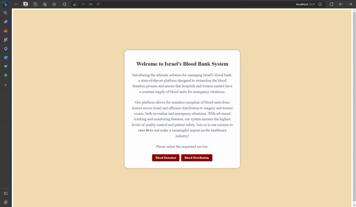

# The Israeli Blood Bank

The Israeli Blood Bank is a web application that allows users to donate and receive blood donations in Israel. It is built using React and Firebase and is designed to be easy to use and navigate.

## System Background:
                    
Introducing the ultimate solution for managing Israel's blood bank: a state-of-the-art platform designed to streamline the blood donation process and ensure that hospitals and trauma centers have a constant supply of blood units for emergency situations.
Our platform allows for seamless reception of blood units from donors across Israel and efficient distribution to surgery and trauma rooms, both in routine and emergency situations. 
With advanced tracking and monitoring features, our system ensures the highest levels of quality control and patient safety. Join us in our mission to save lives and make a meaningful impact on the healthcare industry!

## Features:

- Donation form.
- Only healthy individuals are allowed to donate blood.
- Authentication and authorization using Firebase.
- Delivery of blood donations to hospitals using a secret code.
- Ability to track blood donation requests and donations.
- Export all blood bank operations to a CSV files.

## Usage video

## Runs the app:

In the project directory, you can run:

### `npm start`

Runs the app in the development mode.\
Open [http://localhost:3000](http://localhost:3000) to view it in your browser.

The page will reload when you make changes.\
You may also see any lint errors in the console.

### `npm test`

Launches the test runner in the interactive watch mode.\
See the section about [running tests](https://facebook.github.io/create-react-app/docs/running-tests) for more information.

### `npm run build`

Builds the app for production to the `build` folder.\
It correctly bundles React in production mode and optimizes the build for the best performance.

The build is minified and the filenames include the hashes.\
Your app is ready to be deployed!

See the section about [deployment](https://facebook.github.io/create-react-app/docs/deployment) for more information.

### `npm run eject`

**Note: this is a one-way operation. Once you `eject`, you can't go back!**

If you aren't satisfied with the build tool and configuration choices, you can `eject` at any time. This command will remove the single build dependency from your project.

Instead, it will copy all the configuration files and the transitive dependencies (webpack, Babel, ESLint, etc) right into your project so you have full control over them. All of the commands except `eject` will still work, but they will point to the copied scripts so you can tweak them. At this point you're on your own.

You don't have to ever use `eject`. The curated feature set is suitable for small and middle deployments, and you shouldn't feel obligated to use this feature. However we understand that this tool wouldn't be useful if you couldn't customize it when you are ready for it.

